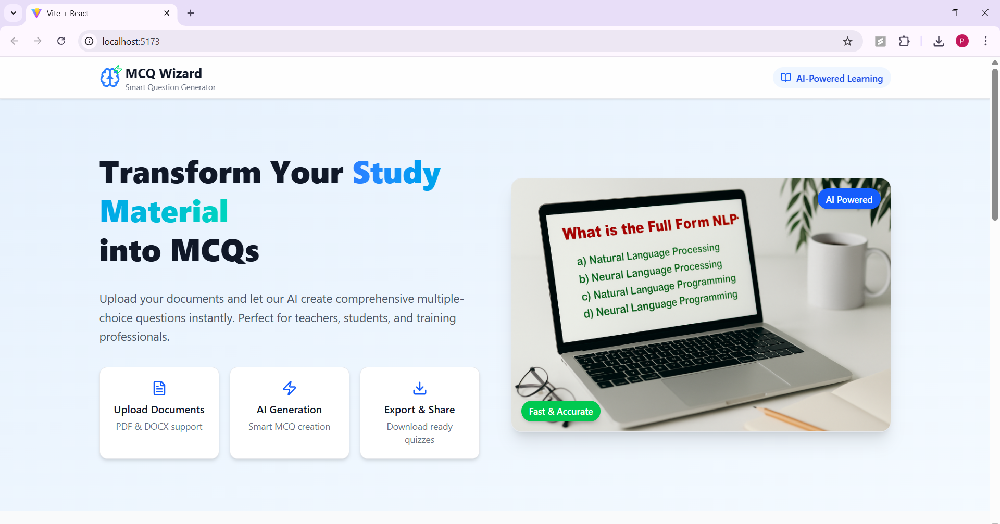
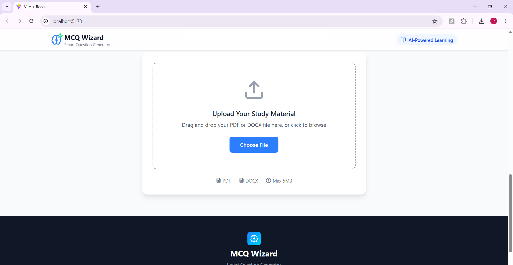
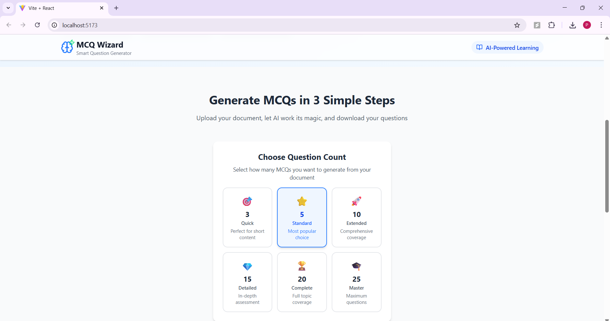
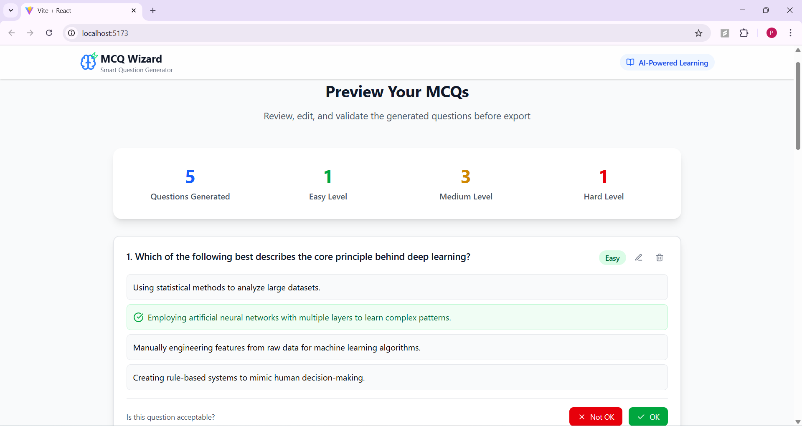
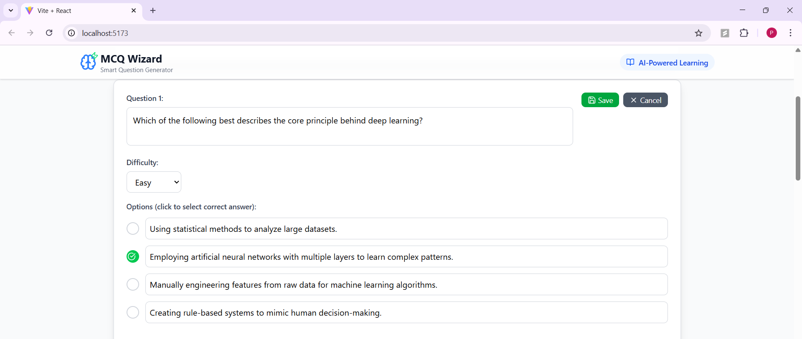
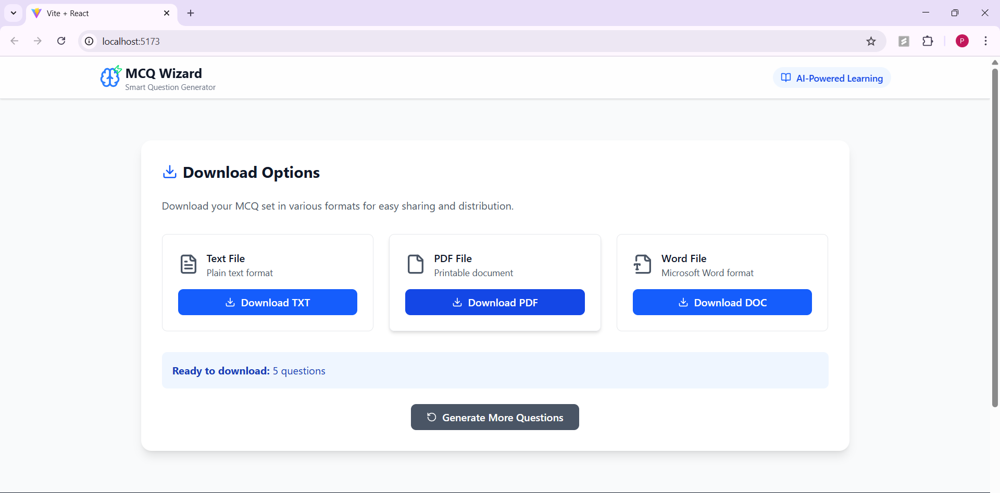

[🔙 Go Back to README](./Readme.md)
# 📸 MCQ Wizard – Screenshots Walkthrough

A visual guide to using **MCQ Wizard**, the AI-powered MCQ generation tool.

---

## 🏠 Home Page

The landing page of the application.

---

## 📁 Upload File

Upload your PDF or DOCX containing study material.

---

## 🎯 Select Number of Questions

Customize how many questions you want to generate.

---

## 🤖 AI Generating Questions

The app uses Gemini AI to process and generate questions.

---

## 🛠️ Review & Edit

You can accept, reject, or edit questions.

---

## 📥 Download Options

Choose from PDF, DOCX, or TXT formats to export your questions.

